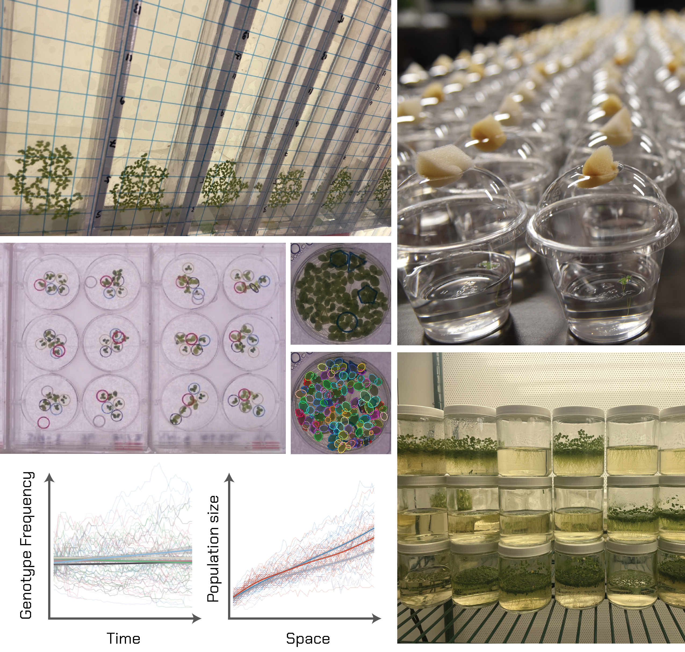
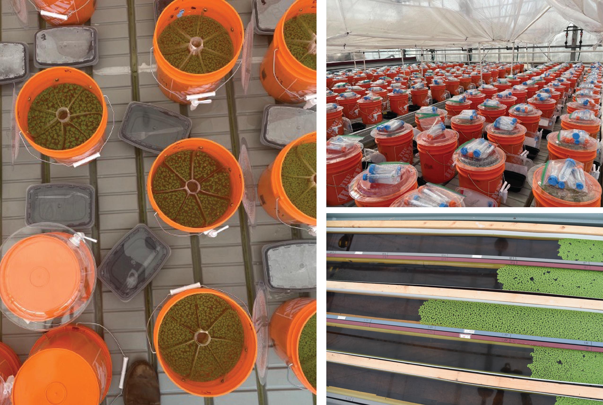
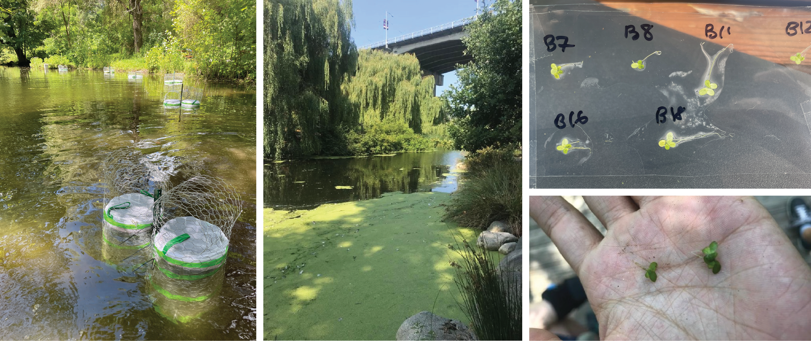
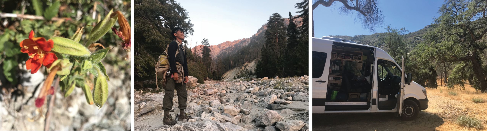

To answer foundational and contemporary questions at the intersection of ecology and evolution, much of our work uses duckweeds (rapidly reproducing aquatic flowering plants) as model organisms in the lab and field. 

We merge experiments with molecular work to link evolutionary mechanisms and processes with ecological dynamics unfolding across populations and communities at a scale of hundreds of thousands of individual plants.

### Experimental evolution
To explore and manipulate evolutionary dynamics, we often employ an experimental evolution approach in the lab using duckweed plants. Using high-throughput phenotyping and sequencing approaches we are able to track how plant and microbial populations evolve across various spatial and environmental contexts in real-time.

The rapid generation time of common duckweeds (2-7 days), the presence of naturally co-occurring and competing species, and the ease at which we can manipulate plant-associated microbes, also make this system highly suitable for experimental evolution work within a community of interacting species

### Microcosm and mesocosm experiments
Conducting eco-evolutionary experiments at large geographical scales (e.g., across latitudinal or elevational ranges) in which we can replicate, manipulate, and track population, evolutionary, and community dynamics can be challenging and is unfeasible for many systems.

In the lab and greenhouse, microcosm and mesocosm approaches offer tractable and creative opportunities to test eco-evolutionary theory that is difficult to conduct in natural populations. One such approach is to conduct experiments within 'miniaturized landscapes' through which we can follow eco-evolutionary processes using small model organisms (like the duckweed-microbe system!) moving across landscapes that fit within a bench top.

At Yale, we are also excited to establish outdoor mesocosm experiments at our nearby field site (stay tuned for more...).

### Field experiments
Experiments conducted in the lab and greenhouse are most powerful when connected to eco-evolutionary processes and patterns observed in natural communities.

In the field, we use a variety of approaches (e.g., common gardens, reciprocal transplants, and community-level manipulations of plants and microbes) to understand how the eco-evolutionary dynamics of colonization, extinction, and community assembly play out in freshwater ecosystems.

Duckweeds, being a cosmopolitan plant for the most part, offer an exciting system to explore the ecological and molecular mechanisms behind how weedy (and often introduced/invasive) plants are able to withstand and thrive in a diverse range of ecological conditions ranging from rural to urban freshwater habitats.

### Meta-analysis and data synthesis
Meta-analyses in ecology and evolution can be a powerful tool for synthesizing overarching temporal (e.g., Usui et al. 2017 J. Anim. Ecol.) and spatial (e.g., Bontrager et al. 2021 Evol.) trends and elucidating their eco-evolutionary predictors.

In collaboration with the Species Range Edge Dynamics (sRED) team, we are also currently involved in various projects using data synthesis approaches to understand the drivers of species geographical range limits and climate-induced range expansion (see Usui et al. 2023 Trends Ecol Evol. for a review paper on the causes and consequences of plasticity at range-edges, which resulted from this collaboration).