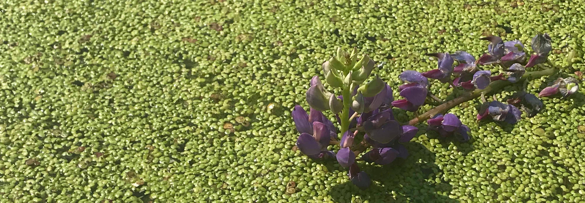

A blanket of duckweed with a fallen purple loosestrife

I am an evolutionary ecologist interested in understanding the processes that shape species' range and niche evolution. Currently, I am particularly interested in the feedback that occurs between evolution and competition (i.e., eco-evolutionary dynamics in communities) and its consequences for population dynamics across space. My research integrates themes from evolutionary biology, population ecology, and community ecology.

I am currently a PhD candidate with [Amy Angert](https://angert.github.io) at the Biodiversity Research Centre, University of British Columbia. I completed my undergraduate studies in Evolutionary Biology at the University of Edinburgh, working with [Ally Phillimore](http://phillimore.bio.ed.ac.uk/home).
&nbsp;

&nbsp;

See [here](https://github.com/takujiusui/takujiusui.github.io/blob/main/TakujiUsuiCV_2021.pdf) for my CV.
