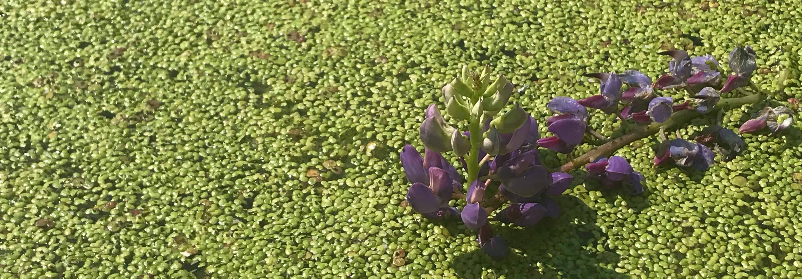

I am committed to taking action to ensure a safe and inclusive workspace in my role as both an educator and researcher, where scientific discourse is enriched by a diversity of perspectives and experiences. Currently, I am serving in the newly formed EDI committee for the [Canadian Society for Ecology and Evolution](https://csee-scee.ca/advancing-equity-diversity-and-inclusion/) where we are actively seeking to improve inclusion, diversity, equity, and accessibility among our society and across Canadian E&E research. In the past, I have also participated in various inclusive [teaching](https://blogs.ubc.ca/bionews/2022/03/teaching-spotlight-getting-to-know-diverse-scientists-in-biol-336/) and [mentorship](https://indigenous.ubc.ca/students/research-mentorship/) initiatives and programs.

Please check back here soon for more updates on teaching and outreach initiatives!

