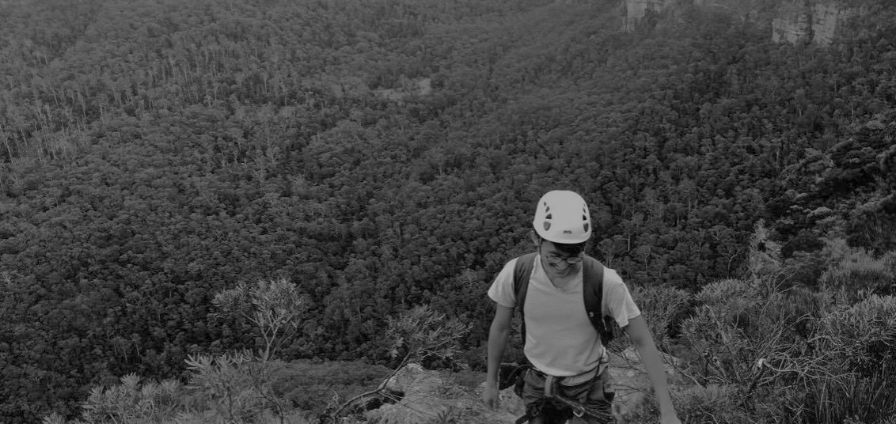

My latest publications can be found on my [Google Scholar page](https://scholar.google.ca/citations?user=aGFgshoAAAAJ&hl=en). Please let me know if you would like a PDF of any articles.
### Pre-prints

**Usui, T.** & Angert, A.L. (2024) Competition enables rapid adaptation to a warming range edge. In Revision at *Science* (Preprint: [doi.org/10.1101/2024.08.22.609250](https://www.biorxiv.org/content/10.1101/2024.08.22.609250v1))

### Published

**Usui, T.** & Angert, A.L. (2024) Range expansion is both slower and more variable with rapid evolution across a spatial gradient in temperature. *Ecology Letters*, 27, e14406. [doi.org/10.1111/ele.14406](https://onlinelibrary.wiley.com/doi/full/10.1111/ele.14406)

Gillies, G.J., Angert, A.L. & **Usui, T.** (2024) Temperature-dependence and genetic variation in resource acquisition strategies in a model freshwater plant. *Functional Ecology*, 38, 1600-1610. [doi.org/10.1111/1365-2435.14567](https://besjournals.onlinelibrary.wiley.com/doi/full/10.1111/1365-2435.14567).

**Usui, T.**, Lerner, D., Angert, A.L., Eckert, I., Garroway, C.J., Hargreaves, A.L., Lancaster, L.T., Lessard, J-P., Riva, F., Schmidt, C., Van der Burg, K. & Marshall, K. (2023) The evolution of plasticity at geographic range edges. *Trends in Ecology & Evolution*, 38, 831-842. [doi:10.1016/j.tree.2023.04.004](https://www.cell.com/trends/ecology-evolution/fulltext/S0169-5347(23)00084-8)

**Usui, T.**, Senior, A., MacLeod, M., McCann, S. & Nakagawa, S. (2021) Meta-analysis of variation suggests that embracing heterogeneity improves both replicability and generalizability in preclinical research. *PloS Biology*, 19(5), e3001009. [doi:10.1371/journal.pbio.3001009](https://journals.plos.org/plosbiology/article?id=10.1371/journal.pbio.3001009)

Bontrager, M., **Usui, T.**, Lee-Yaw, J.A., Anstett, D.N., Branch, H.A., Hargreaves, A.L. & Angert, A.L. (2021) Adaptation across geographic ranges is consistent with strong selection in marginal climates and legacies of range expansion. *Evolution*, 75, 1316-1333. [doi:10.1111/evo.14231](https://onlinelibrary.wiley.com/doi/10.1111/evo.14231)

Germain, R.M., Angert, A.L., Bassar, R.D., Henao Diaz, F.L., Hart, S.P., Otto, S.P., Rolland, J., Sakarchi, J., Schluter, D., Siepielski, A.M., Turcotte, M.M., **Usui, T.** & Waters, M. (2020) On the origin of coexisting species. *Trends in Ecology & Evolution*, 36, 284-283. [doi:10.1016/j.tree.2020.11.006](https://www.cell.com/trends/ecology-evolution/fulltext/S0169-5347(20)30339-6)

Miller, T.E.X., Angert, A.L.A., Brown, C.D., Lee-Yaw, J.A., Lewis, M., Lutscher, F., Marculis, N.G., Melbourne, B.A., Shaw, A.K., Szücs, M., Tabares, O., **Usui, T.**, Weiss-Lehman, C. & Williams, J.L. (2020) Eco-evolutionary dynamics of range expansion. *Ecology*, 101, e03139. [doi:10.1002/ecy.3139](https://esajournals.onlinelibrary.wiley.com/doi/abs/10.1002/ecy.3139)

Baur, J., Laurentino, T.G., **Usui, T.** & Eichhorn M. (2019) Liana abundance and relationships to sapling and tree hosts in an East African primary forest. *African Journal of Ecology*, 57, 130-136. [doi:10.1111/aje.12584](https://onlinelibrary.wiley.com/doi/full/10.1111/aje.12584)

**Usui, T.** & Angert, A.L.A. (2018) *Species Ranges.* Elsevier Reference Module in Life Sciences.

**Usui, T.**, Noble, D.W.A., O’Dea, R.E., Fangmeier, M.L., Lagisz, M., Hesselson, D. & Nakagawa, S. (2018) The French Press: a repeatable and high-throughput approach to exercising zebrafish (*Danio rerio*). *PeerJ*, e4292. [doi:10.7717/peerj.4292](https://peerj.com/articles/4292/)

Fangmeier, M., Noble, D.W.A., O’Dea, R.E., **Usui, T.**, Lagisz, M., Hesselson, D. & Nakagawa, S. (2018) Computer animation technology in behavioral sciences: a sequential, automatic, and high-throughput approach to quantifying personality in zebrafish (*Danio rerio*). *Zebrafish*, 15, 206-210. [doi:10.1089/zeb.2017.1532](https://www.liebertpub.com/doi/abs/10.1089/zeb.2017.1532)

**Usui, T.**, Butchart, S.H.M. & Phillimore, A.B. (2017) Temporal shifts and temperature sensitivity of avian spring migration phenology: a phylogenetic meta-analysis. *Journal of Animal Ecology*, 86, 250-261. [doi:10.1111/1365-2656.12612](https://besjournals.onlinelibrary.wiley.com/doi/full/10.1111/1365-2656.12612)

Trad climbing in the Blue Mountains, Australia

