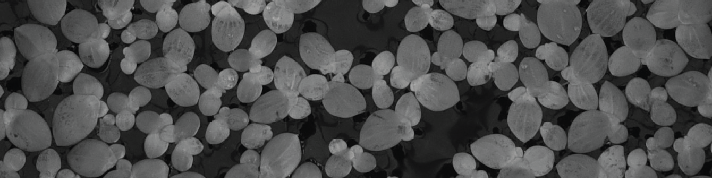

For the latest publications, please check [Google Scholar](https://scholar.google.ca/citations?user=aGFgshoAAAAJ&hl=en). Please let me know if you would like a PDF of any articles. † = co-first authors; * = co-senior authors; ‡ undergraduate students

### Pre-prints

Urquhart, C.A., **Usui, T.**, Angert, A.L. & Williams, J.L. (2026)
 [Eco-evolutionary dynamics are shaped by competition in experimental range expansions](https://www.biorxiv.org/content/10.64898/2026.06.01.729372v1). 
 *BioRxiv*, doi: 10.64898/2026.06.01.729372

**Usui, T.**†, Sakarchi, J.†, Duchen, P., Hart, S.P., Turcotte, M.M., Xu, S., Angert, A.L.* & Germain, R.M.* (2026) 
 [Niche differentiation confers coexistence prior to the species boundary in an aquatic plant](https://www.biorxiv.org/content/10.64898/2026.04.03.716288v1). 
 *BioRxiv*, doi: 10.64898/2026.04.03.716288.

Marjakangas, E-L., Barreto, E., Borregaard, M.K., Chaikin, S., Carvajal-Quintero, J.D., Marshall, K.E., **Usui, T.**, Pires, M.M., Graham, C.H. & Lessard, J-P. (2026) 
 The role of biotic permeability in species range dynamics. 
 *In revision*

### Published

**Usui, T.**†, Yu, J.†‡ & Frederickson, M.E. (2026) 
 [For colonization success, should hosts and microbes travel alone, together, or swap partners along the way?](https://nph.onlinelibrary.wiley.com/doi/10.1111/nph.71372)
 *New Phytologist*, Early View

**Usui, T.** & Angert, A.L. (2026) 
 [Competition enables rapid adaptation to a warming range edge in a model plant community](https://www.science.org/doi/10.1126/science.ads4664).
 *Science*, 392, 6802

**Usui, T.** & Angert, A.L. (2024) 
 [Range expansion is both slower and more variable with rapid evolution across a spatial gradient in temperature](https://onlinelibrary.wiley.com/doi/full/10.1111/ele.14406). 
 *Ecology Letters*, 27, e14406

Gillies, G.J.‡, Angert, A.L. & **Usui, T.** (2024) 
 [Temperature-dependence and genetic variation in resource acquisition strategies in a model freshwater plant](https://besjournals.onlinelibrary.wiley.com/doi/full/10.1111/1365-2435.14567).
 *Functional Ecology*, 38, 1600-1610

**Usui, T.**†, Lerner, D.†, Angert, A.L., Eckert, I., Garroway, C.J., Hargreaves, A.L., Lancaster, L.T., Lessard, J-P., Riva, F., Schmidt, C., Van der Burg, K. & Marshall, K. (2023) 
 [The evolution of plasticity at geographic range edges](https://www.cell.com/trends/ecology-evolution/fulltext/S0169-5347(23)00084-8).
 *Trends in Ecology & Evolution*, 38, 831-842

**Usui, T.**, MacLeod, M., McCann, S., Senior, A.* & Nakagawa, S.* (2021) 
 [Meta-analysis of variation suggests that embracing heterogeneity improves both replicability and generalizability in preclinical research](https://journals.plos.org/plosbiology/article?id=10.1371/journal.pbio.3001009). 
 *PloS Biology*, 19(5), e3001009

Bontrager, M., **Usui, T.**, Lee-Yaw, J.A., Anstett, D.N., Branch, H.A., Hargreaves, A.L. & Angert, A.L. (2021) 
 [Adaptation across geographic ranges is consistent with strong selection in marginal climates and legacies of range expansion](https://onlinelibrary.wiley.com/doi/10.1111/evo.14231). 
 *Evolution*, 75, 1316-1333

Germain, R.M., Angert, A.L., Bassar, R.D., Henao Diaz, F.L., Hart, S.P., Otto, S.P., Rolland, J., Sakarchi, J., Schluter, D., Siepielski, A.M., Turcotte, M.M., **Usui, T.** & Waters, M. (2020) 
 [On the origin of coexisting species](https://www.cell.com/trends/ecology-evolution/fulltext/S0169-5347(20)30339-6). 
 *Trends in Ecology & Evolution*, 36, 284-283

Miller, T.E.X., Angert, A.L.A., Brown, C.D., Lee-Yaw, J.A., Lewis, M., Lutscher, F., Marculis, N.G., Melbourne, B.A., Shaw, A.K., Szücs, M., Tabares, O., **Usui, T.**, Weiss-Lehman, C. & Williams, J.L. (2020) 
 [Eco-evolutionary dynamics of range expansion](https://esajournals.onlinelibrary.wiley.com/doi/abs/10.1002/ecy.3139). 
 *Ecology*, 101, e03139

Baur, J., Laurentino, T.G., **Usui, T.** & Eichhorn M. (2019) 
 [Liana abundance and relationships to sapling and tree hosts in an East African primary forest](https://onlinelibrary.wiley.com/doi/full/10.1111/aje.12584).  *African Journal of Ecology*, 57, 130-136

**Usui, T.** & Angert, A.L.A. (2018) 
 [*Species Ranges*](https://www.sciencedirect.com/science/chapter/referencework/abs/pii/B978012809633890400X).
 Elsevier Reference Module in Life Sciences

**Usui, T.**, Noble, D.W.A., O’Dea, R.E., Fangmeier, M.L., Lagisz, M., Hesselson, D. & Nakagawa, S. (2018) 
 [The French Press: a repeatable and high-throughput approach to exercising zebrafish (*Danio rerio*)](https://peerj.com/articles/4292/). 
 *PeerJ*, e4292

Fangmeier, M., Noble, D.W.A., O’Dea, R.E., **Usui, T.**, Lagisz, M., Hesselson, D. & Nakagawa, S. (2018) 
 [Computer animation technology in behavioral sciences: a sequential, automatic, and high-throughput approach to quantifying personality in zebrafish (*Danio rerio*)](https://www.liebertpub.com/doi/abs/10.1089/zeb.2017.1532). 
 *Zebrafish*, 15, 206-210

**Usui, T.**, Butchart, S.H.M. & Phillimore, A.B. (2017) 
 [Temporal shifts and temperature sensitivity of avian spring migration phenology: a phylogenetic meta-analysis](https://besjournals.onlinelibrary.wiley.com/doi/full/10.1111/1365-2656.12612). 
 *Journal of Animal Ecology*, 86, 250-261

