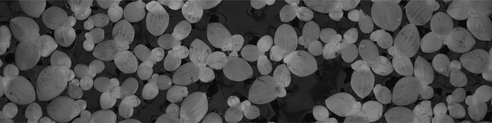

<h2 class="biodiversity-heading">
  Publications
</h2>

For the latest publications, please check <a href="https://scholar.google.ca/citations?user=aGFgshoAAAAJ&hl=en">Google Scholar</a>. Please let me know if you would like a PDF of any articles. † = co-first authors; * = co-senior authors; ‡ = undergraduate students

<h3 class="research-heading">
  Pre-prints
</h3>

Urquhart, C.A., <strong>Usui, T.</strong>, Angert, A.L. & Williams, J.L. (2026)   <a href="https://www.biorxiv.org/content/10.64898/2026.06.01.729372v1">Eco-evolutionary dynamics are shaped by competition in experimental range expansions</a>.   <i>BioRxiv</i>, doi: 10.64898/2026.06.01.729372

<strong>Usui, T.</strong>†, Sakarchi, J.†, Duchen, P., Hart, S.P., Turcotte, M.M., Xu, S., Angert, A.L.* & Germain, R.M.* (2026)   <a href="https://www.biorxiv.org/content/10.64898/2026.04.03.716288v1">Niche differentiation confers coexistence prior to the species boundary in an aquatic plant</a>.   <i>BioRxiv</i>, doi: 10.64898/2026.04.03.716288

Marjakangas, E-L., Barreto, E., Borregaard, M.K., Chaikin, S., Carvajal-Quintero, J.D., Marshall, K.E., <strong>Usui, T.</strong>, Pires, M.M., Graham, C.H. & Lessard, J-P. (2026)  
The role of biotic permeability in species range dynamics.   <i>In revision</i>

<h3 class="research-heading">
  Published
</h3>

<strong>Usui, T.</strong>†, Yu, J.†‡ & Frederickson, M.E. (2026)   <a href="https://nph.onlinelibrary.wiley.com/doi/10.1111/nph.71372">For colonization success, should hosts and microbes travel alone, together, or swap partners along the way?</a>   <i>New Phytologist</i>, Early View

<strong>Usui, T.</strong> & Angert, A.L. (2026)   <a href="https://www.science.org/doi/10.1126/science.ads4664">Competition enables rapid adaptation to a warming range edge in a model plant community</a>.   <i>Science</i>, 392, 6802

<strong>Usui, T.</strong> & Angert, A.L. (2024)   <a href="https://onlinelibrary.wiley.com/doi/full/10.1111/ele.14406">Range expansion is both slower and more variable with rapid evolution across a spatial gradient in temperature</a>.   <i>Ecology Letters</i>, 27, e14406

Gillies, G.J.‡, Angert, A.L. & <strong>Usui, T.</strong> (2024)   <a href="https://besjournals.onlinelibrary.wiley.com/doi/full/10.1111/1365-2435.14567">Temperature-dependence and genetic variation in resource acquisition strategies in a model freshwater plant</a>.   <i>Functional Ecology</i>, 38, 1600-1610

<strong>Usui, T.</strong>†, Lerner, D.†, Angert, A.L., Eckert, I., Garroway, C.J., Hargreaves, A.L., Lancaster, L.T., Lessard, J-P., Riva, F., Schmidt, C., Van der Burg, K. & Marshall, K. (2023)   <a href="https://www.cell.com/trends/ecology-evolution/fulltext/S0169-5347(23)00084-8">The evolution of plasticity at geographic range edges</a>.   <i>Trends in Ecology & Evolution</i>, 38, 831-842

<strong>Usui, T.</strong>, MacLeod, M., McCann, S., Senior, A.* & Nakagawa, S.* (2021)   <a href="https://journals.plos.org/plosbiology/article?id=10.1371/journal.pbio.3001009">Meta-analysis of variation suggests that embracing heterogeneity improves both replicability and generalizability in preclinical research</a>.   <i>PLOS Biology</i>, 19(5), e3001009

Bontrager, M., <strong>Usui, T.</strong>, Lee-Yaw, J.A., Anstett, D.N., Branch, H.A., Hargreaves, A.L. & Angert, A.L. (2021)   <a href="https://onlinelibrary.wiley.com/doi/10.1111/evo.14231">Adaptation across geographic ranges is consistent with strong selection in marginal climates and legacies of range expansion</a>.   <i>Evolution</i>, 75, 1316-1333

Germain, R.M., Angert, A.L., Bassar, R.D., Henao Diaz, F.L., Hart, S.P., Otto, S.P., Rolland, J., Sakarchi, J., Schluter, D., Siepielski, A.M., Turcotte, M.M., <strong>Usui, T.</strong> & Waters, M. (2020)   <a href="https://www.cell.com/trends/ecology-evolution/fulltext/S0169-5347(20)30339-6">On the origin of coexisting species</a>.   <i>Trends in Ecology & Evolution</i>, 36, 284-283

Miller, T.E.X., Angert, A.L.A., Brown, C.D., Lee-Yaw, J.A., Lewis, M., Lutscher, F., Marculis, N.G., Melbourne, B.A., Shaw, A.K., Szücs, M., Tabares, O., <strong>Usui, T.</strong>, Weiss-Lehman, C. & Williams, J.L. (2020)   <a href="https://esajournals.onlinelibrary.wiley.com/doi/abs/10.1002/ecy.3139">Eco-evolutionary dynamics of range expansion</a>.   <i>Ecology</i>, 101, e03139

Baur, J., Laurentino, T.G., <strong>Usui, T.</strong> & Eichhorn, M. (2019)   <a href="https://onlinelibrary.wiley.com/doi/full/10.1111/aje.12584">Liana abundance and relationships to sapling and tree hosts in an East African primary forest</a>.   <i>African Journal of Ecology</i>, 57, 130-136

<strong>Usui, T.</strong> & Angert, A.L.A. (2018)   <a href="https://www.sciencedirect.com/science/chapter/referencework/abs/pii/B978012809633890400X"><i>Species Ranges</i></a>.  
Elsevier Reference Module in Life Sciences

<strong>Usui, T.</strong>, Noble, D.W.A., O’Dea, R.E., Fangmeier, M.L., Lagisz, M., Hesselson, D. & Nakagawa, S. (2018)   <a href="https://peerj.com/articles/4292/">The French Press: a repeatable and high-throughput approach to exercising zebrafish (<i>Danio rerio</i>)</a>.   <i>PeerJ</i>, e4292

Fangmeier, M., Noble, D.W.A., O’Dea, R.E., <strong>Usui, T.</strong>, Lagisz, M., Hesselson, D. & Nakagawa, S. (2018)   <a href="https://www.liebertpub.com/doi/abs/10.1089/zeb.2017.1532">Computer animation technology in behavioral sciences: a sequential, automatic, and high-throughput approach to quantifying personality in zebrafish (<i>Danio rerio</i>)</a>.   <i>Zebrafish</i>, 15, 206-210

<strong>Usui, T.</strong>, Butchart, S.H.M. & Phillimore, A.B. (2017)   <a href="https://besjournals.onlinelibrary.wiley.com/doi/full/10.1111/1365-2656.12612">Temporal shifts and temperature sensitivity of avian spring migration phenology: a phylogenetic meta-analysis</a>.   <i>Journal of Animal Ecology</i>, 86, 250-261

