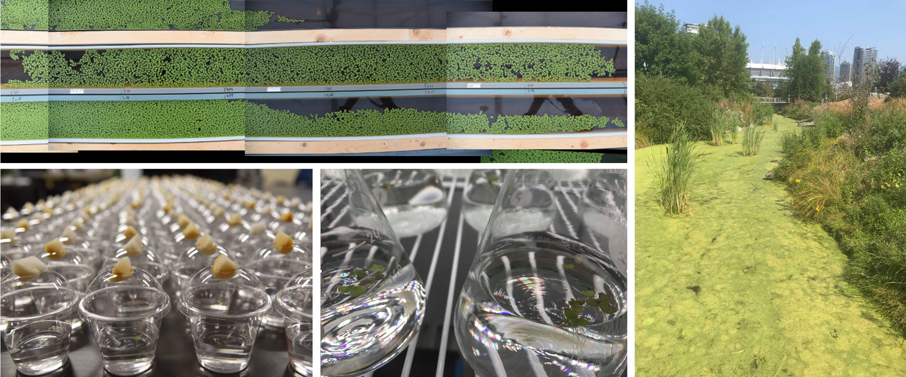
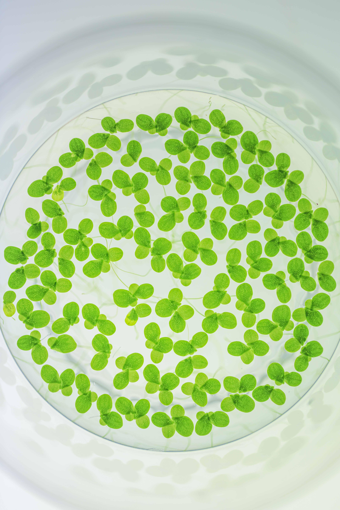

Experimental range expansion of the common duckweed,<i> Lemna minor</i>

### Species range dynamics in a warming world
Understanding the movement of species geographical ranges is a fundamental goal of ecology and is of urgent importance given rapid global change. The expansion of species ranges (due to climate-driven range shifts or the introduction of new species) can lead to unique evolutionary changes in range-edge populations, and these  evolutionary changes may in turn shape the dynamics of range expansion through eco-evolutionary feedbacks. Understanding future changes to species distributions therefore requires predictive frameworks and experimental tests of the eco-evolutionary dynamics of range expansion (see [Usui et al. 2023 Trends Ecol. Evol.](https://www.cell.com/trends/ecology-evolution/fulltext/S0169-5347(23)00084-8) and [Miller et al. 2020 Ecol.](https://esajournals.onlinelibrary.wiley.com/doi/abs/10.1002/ecy.3139) for our perspective pieces).

I am currently using an experimental evolution approach using duckweeds (freshwater angiosperms) as a model plant community to test theories on how rapid eco-evolutionary interactions alter the dynamics of range expansion (e.g., [Usui & Angert 2024 Ecol. Lett.](https://onlinelibrary.wiley.com/doi/full/10.1111/ele.14406)). I use both rigorous field experiments and high-throughput experimental landscapes in the lab and greenhouse, through which I can track the ecological and evolutionary dynamics of populations and species moving across space and in real-time. Some of my current projects explore: 1) how environmental variation in space and time influences the predictability of range expansions; 2) how species interactions (from competition to mutualisms) and co-evolution alters the dynamics of range expanding communities; and 3) the role of epigenetic mechanisms in mediating adaptive plasticity and colonization for clonal and invasive duckweeds.

Experimental evolution of duckweed communities in the lab and greenhouse. Right photo shows a local sampling site in Vancouver, BC

### Adaptation to warming within ecological communities
Species ranges will shift or contract if range-edge populations cannot persist through a rapidly changing climate. Predicting the demographic and evolutionary fate of populations and species in response to climate change therefore remains a pressing challenge for ecologists and evolutionary biologists. While population responses to rising temperatures occur within a community context where interacting species have the potential to impact eco-evolutionary outcomes, we lack a mechanistic understanding of how and when species interactions will alter population and evolutionary responses under warming, and its subsequent impact on species distributions and community structure.

My research therefore seeks to improve mechanistic predictions for how ecological communities respond to warming. Recently, I have tested how interspecific competition between duckweed species alters adaptive evolution to warming in experimental ranges. I have found that competition enabled the evolution of high-temperature tolerance, and that surprisingly, competition was necessary for range-edge populations to adapt to warming ([Usui & Angert, in review at Science](https://www.biorxiv.org/content/10.1101/2024.08.22.609250v1.full.pdf+html)). To understand the mechanisms for how competitive interactions will change with warming, a former undergraduate mentee also recently tested how resource-use traits underlying competition changes with thermal stress for natural *L. minor* duckweeds ([Gillies et al. 2024 Funct. Ecol.](https://besjournals.onlinelibrary.wiley.com/doi/full/10.1111/1365-2435.14567)).

### Evolution of species coexistence
The immense biodiversity that we see across space and time, and the mechanisms leading to its origins and maintenance, is a key question that unites ecology and evolutionary biology. While evolutionary theory states that species diversity is initiated by the genetic divergence of lineages through the evolution of reproductive isolation (i.e., speciation), ecological theory states successful speciation may also hinge upon whether ecological differentiation could could permit lineages to coexist long enough to cross the species boundary. When and how mechanisms of demographic persistence and coexistence evolves over time (i.e., the tempo and mode of coexistence mechanisms) then, is critical to our understanding of the origins and maintenance of the contemporary assemblage of species observed today (see [Germain et al. 2021 Trends Ecol. Evol.](https://www.cell.com/trends/ecology-evolution/fulltext/S0169-5347(20)30339-6) for our perspective piece).

In a huge common garden consisting of 1890 competition trials simulating secondary contact between 126 allopatric and genetically diverging lineages of duckweed, we recently empirically parameterized the tempo and mode of coexistence evolution at timescales critical to speciation (Usui, Sakarchi et al., in prep.). Some of my other current projects on the evolution of species coexistence include: 1) the evolution of coexistence and reproductive isolation in hybrid duckweed species; 2) how rapid changes in climate across space and time alter the evolution of coexistence mechanisms and parapatric range limits; and 3) how evolution in host-symbiont communities alters resource competition and coexistence outcomes over time.

Common duckweed,<i> Lemna minor.</i> Photo by Emma Menchions

