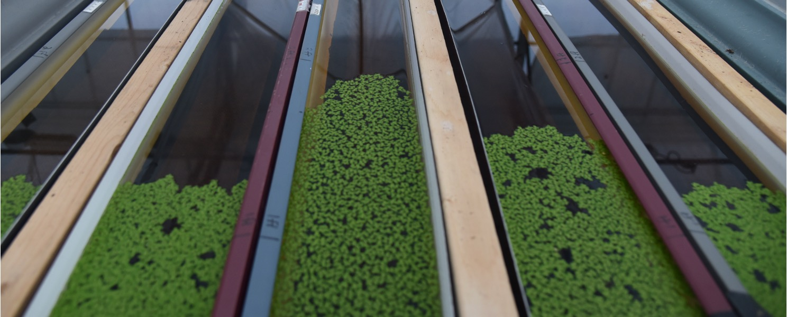

Population spread of <i> Lemna minor</i>

### Eco-evolutionary dynamics of range expansion
Predicting the dynamics of biological invasions and colonizations require an understanding of the eco-evolutionary drivers that influence population spread. Simple models of range expansions state the importance of both demography and dispersal in governing the speed of population spread. However, more recent theory suggest that these processes are further influenced by a suite of other factors including rapid evolution that occurs during population spread, as well as selection from spatially heterogeneous landscapes. <i>We thus require empirical explorations that test predictions of how evolution influences, and is influenced by, range expansions across ecologically complex landscapes.</i>

To explore these ideas, during my PhD, I have established replicated, experimental ranges in the greenhouse using the freshwater angiosperm duckweed as a model organism. Spatio-temporally controlled environments within the landscape allow populations to experience selection from an underlying ecological gradient, where both ecological and evolutionary changes can be tracked in real-time as replicated populations spread across space.

In a recent working group, we also assessed the deterministic and stochastic outcomes of these eco-evolutionary dynamics on range expansion, and proposed a framework for understanding how these feedbacks might modulate both the mean and predictability of range expansions ([Miller et al. 2020 Ecology](https://esajournals.onlinelibrary.wiley.com/doi/abs/10.1002/ecy.3139))

### Competition and evolutionary rescue at the range-edge
Climate induced shifts in species distributions are altering the strength of biotic
interactions at species’ range-edges. As immigrant species colonize newly suitable areas
at their leading-edge to track their climatic niche, they may exert greater competitive effects
on resident species at their trailing-edge for whom the area is climatically deteriorating. Such competition will affect the degree to which resident populations can persist through demographic and evolutionary responses (i.e., rescue) to climate change. 

How does competition affect adaptation to changing environments? And how does this apply in the context of range-edge populations experiencing the simultaneous stresses of climate change and increased competition?<i> Using experimental evolution of duckweed communities across a spatio-temporally changing landscape, my projects here aim to empirically quantify the effects of competition on the rescue of trailing-edge populations</i>.

Common duckweed,<i> Lemna minor.</i> Photo by Emma Menchions

### Evolution and coexistence
How do mechanisms of species coexistence evolve across micro- and macro-evolutionary scales, and in turn, how does this influence the persistence of communities? In collaboration with the [Germain Lab at UBC](https://germainlab.weebly.com/), we are using duckweeds to empirically test the micro-evolutionary trajectory of coexistence. In a recent working group, we also produced a perspective piece investigating, at the macroevolutionary scale, the role of coexistence mechanisms in the origin and maintenance of new species ([Germain et al. 2020](https://www.cell.com/trends/ecology-evolution/fulltext/S0169-5347(20)30339-6)).

### Meta-analyses and scientific replicability
Meta-analyses in ecology and evolution can be a powerful tool for synthesizing overarching patterns and generating new hypotheses. During my undergraduate, I conducted a phylogenetic meta-analysis to investigate if ecological and geographical drivers could explain some of the variability seen in changes in spring migratory phenology of birds with climate change ([Usui et al. 2017 Journal of Animal Ecology](https://besjournals.onlinelibrary.wiley.com/doi/full/10.1111/1365-2656.12612)). We found that life-history traits such as migration distance was able to explain some of this variation. We also found a phylogenenetic signal in phenological response, although substantial species and spatial variation in phenology remained.

More recently, I have used meta-analyses to explore scientific replicability. In an interdisciplinary collaboration spanning the fields of evolutionary biology (I-DEEL lab, University of New South Wales) and biomedical science (CAMARADES team, University of Edinburgh), we explored the idea that, counter to long-held belief, experimental standardization may actually lead to reduced replicability through generating idiosyncratic effects. We argue the importance of embracing variability in effect-sizes, and suggest that experimental methodologies that generate variability in effect sizes should be incorporated in a systematic manner ([Usui et al. 2020 PloS Biology](https://journals.plos.org/plosbiology/article?id=10.1371/journal.pbio.3001009)). <i>I am interested in exploring this idea further in ecology and evolution, and would love to chat with any potential collaborators!</i>
