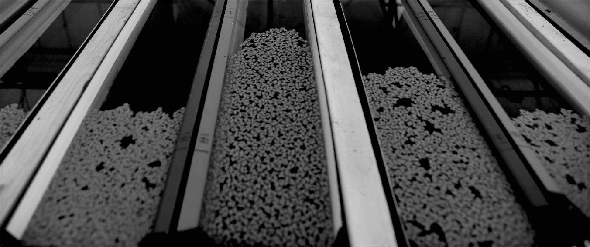
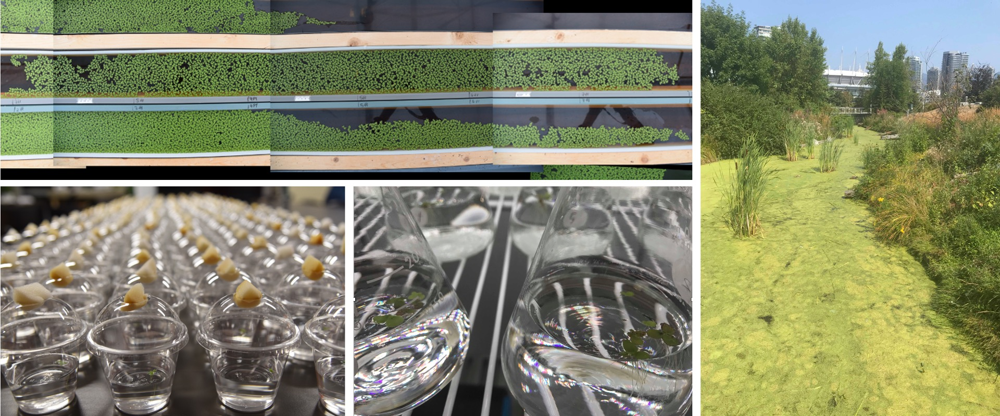
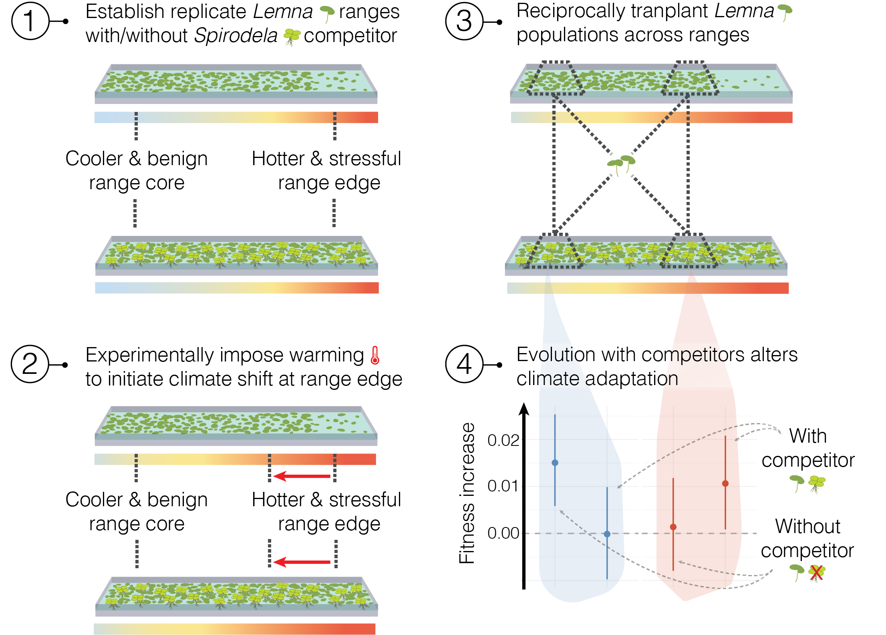
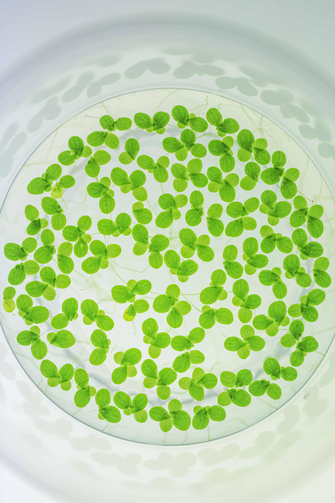

<a href="https://onlinelibrary.wiley.com/doi/full/10.1111/ele.14406">From Usui & Angert (2024) <i>Ecol. Lett.</i></a>

### Species range dynamics under global change

***How will species shift their geographical range in response to environmental change?***

***What are the ecological and molecular mechanisms that allow populations to spread and invade?***

***What limits a species geographical range and ecological niche?***

Understanding the ecological and evolutionary processes that shape species geographical ranges and their limits is a fundamental goal of ecology. With global change, it is also an increasingly urgent goal as species distributions rapidly change in response to environmental change and due to accelerating biological introductions.

The expansion and contraction of species ranges can generate distinct evolutionary changes in range-edge populations, and these evolutionary changes may in turn shape the dynamics of range expansion and contraction through eco-evolutionary feedbacks. Understanding species range dynamics under global change therefore requires predictive frameworks and experimental tests of how spatial eco-evolutionary dynamics unfold across moving populations and changing environments.

To explore these questions, we use a variety of experimental and molecular approaches in the lab and field, including the experimental evolution of duckweeds (one of the smallest and most rapidly reproducing flowering plants; see [Approaches](/approaches/)) in spatially structured microcosms, mesocosms, and ponds, which allows us to track and manipulate plant populations moving and evolving across space and in real-time.

Experimental evolution of duckweed communities in the lab and greenhouse. Right: Duckweeds in Vancouver BC

### Eco-evolutionary dynamics of competition and species coexistence

***How will eco-evolutionary responses to environmental change unfold within competitive communities?***

***How does competition alter species range dynamics and spatial patterns of coexistence?***

***How will species evolve to coexist during community (re-)assembly?***

Species rarely experience environmental change in isolation. Instead, eco-evolutionary responses to environmental change occur within a community context where interacting and competing species have the potential to alter population, evolutionary, and community outcomes.

Through merging experimental evolution with community ecology, our lab seeks to understand the reciprocal interactions between competition and evolution, asking: (1) when and how does competition alter evolutionary responses to environmental change? And, in turn, (2) how does evolution alter mechanisms of competition, species coexistence, and community assembly?

Ultimately, we seek to understand how competition and evolution interact across landscapes and over time, to maintain populations and structure communities in a changing world.

 

Testing local adaptation to warming range edges in competitive plant communities (from Usui & Angert, Science 2026)

### Eco-evolutionary dynamics of plant-microbe interactions

***How do plant-microbe interactions co-evolve across space and with environmental change?***

***How do microbial symbionts alter host evolution, distribution, and coexistence?***

***How does the microbiome assemble on host plants?***

Almost all eukaryotic organisms harbour microbial partners (symbionts) that live on or inside host tissues. These microbial partners can alter host performance and vice versa, with interactions spanning from mutualism to antagonism. How host-microbe interactions change and co-evolve —and how these interactions help shape host and microbial distribution, coexistence, and rapid evolution in response to environmental change— remain key, open questions.

The microbes residing in and on duckweeds have been described [since the 17th century](https://pictures.royalsociety.org/image-rs-9609). We use duckweeds and their microbial symbionts as a powerful and tractable model system for studying plant-microbial interactions across scales. By combining lab and field experiments with molecular tools and high-throughput phenotyping (see [Approaches](/approaches/)), we can test fundamental questions on the eco-evolutionary processes shaping plant-microbe interactions, and how these interactions consequently shape larger scale patterns of biodiversity.

Common duckweed,<i> Lemna minor.</i> Photo by Emma Menchions

