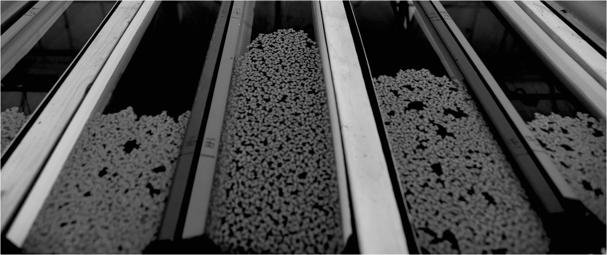

Experimental range expansion of the common duckweed,<i> Lemna minor</i>

### Eco-evolutionary dynamics of species geographical ranges
Understanding the movement of species ranges is a fundamental goal of ecology and is of urgent importance given rapid global change. The expansion and contraction of geographical ranges across space can lead to rapid changes in the evolutionary trajectory of range-edge populations, and these  evolutionary changes may in turn shape the extent and movement of species ranges. Understanding future changes to species ranges therefore requires predictive frameworks and experimental tests of the eco-evolutionary dynamics of species ranges (see [Usui et al. 2023 Trends in Ecology & Evolution](https://www.cell.com/trends/ecology-evolution/fulltext/S0169-5347(23)00084-8) and [Miller et al. 2020 Ecology](https://esajournals.onlinelibrary.wiley.com/doi/abs/10.1002/ecy.3139) for our perspective pieces).

I am currently using an experimental evolution approach with duckweed communities (a freshwater angiosperm) to test theories on how these eco-evolutionary feedbacks alter the dynamics of range expansion and contraction. I use replicate, experimental landscapes in which I can track the ecological and evolutionary dynamics of populations and species moving across space and in real-time. Some of my current projects explore: 1) how environmental variation in space and time influences the predictability of range expansions; and 2) how rapid evolution within competitive and host-symbiont communities alter the dynamics of range expansion, range contraction, and evolutionary rescue (publications coming soon!).

Experimental evolution of duckweed communities in the lab and greenhouse. Right photo shows a local sampling site in Vancouver, BC

### Eco-evolutionary dynamics and coexistence
Rapid evolution can also significantly alter, and be altered by, the ecological mechanisms that maintain biodiversity across space and time (i.e., species coexistence mechanisms). Using competing duckweed species and communities, we recently tested if coexistence mechanisms can accrue and evolve across competing populations at the micro-evolutionary scale, and the consequences of this evolution on the origins and maintenance of competing species at the macro-evolutionary scale (see [Germain et al. 2020 Trends in Ecology & Evolution](https://www.cell.com/trends/ecology-evolution/fulltext/S0169-5347(20)30339-6) for our perspective piece). Some of my other current projects here explore: 1) how rapid changes in climate across space and time alter the evolution of coexistence mechanisms; and 2) how evolution in host-symbiont communities alter resource competition and coexistence outcomes.

Common duckweed,<i> Lemna minor.</i> Photo by Emma Menchions

### Meta-analyses and scientific replicability
Meta-analyses in ecology and evolution can be a powerful tool for synthesizing overarching patterns and generating new hypotheses. During my undergraduate, I conducted a phylogenetic meta-analysis to investigate if ecological and geographical drivers could explain some of the variability seen in changes in spring migratory phenology of birds with climate change ([Usui et al. 2017 Journal of Animal Ecology](https://besjournals.onlinelibrary.wiley.com/doi/full/10.1111/1365-2656.12612)). We found that life-history traits such as migration distance was able to explain some of this variation. We also found a phylogenenetic signal in phenological response, although substantial species and spatial variation in phenology remained.

More recently, I have used meta-analyses to explore scientific replicability. In an interdisciplinary collaboration spanning the fields of evolutionary biology (I-DEEL lab, University of New South Wales) and biomedical science (CAMARADES team, University of Edinburgh), we explored the idea that, counter to long-held belief, experimental standardization may actually lead to reduced replicability through generating idiosyncratic effects. We argue the importance of embracing variability in effect-sizes, and suggest that experimental methodologies that generate variability in effect sizes should be incorporated in a systematic manner ([Usui et al. 2020 PloS Biology](https://journals.plos.org/plosbiology/article?id=10.1371/journal.pbio.3001009)). <i>I am exploring this idea further in ecology and evolution, and would love to chat with any potential collaborators!</i>
