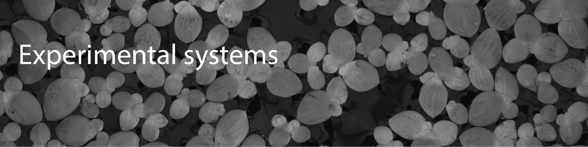
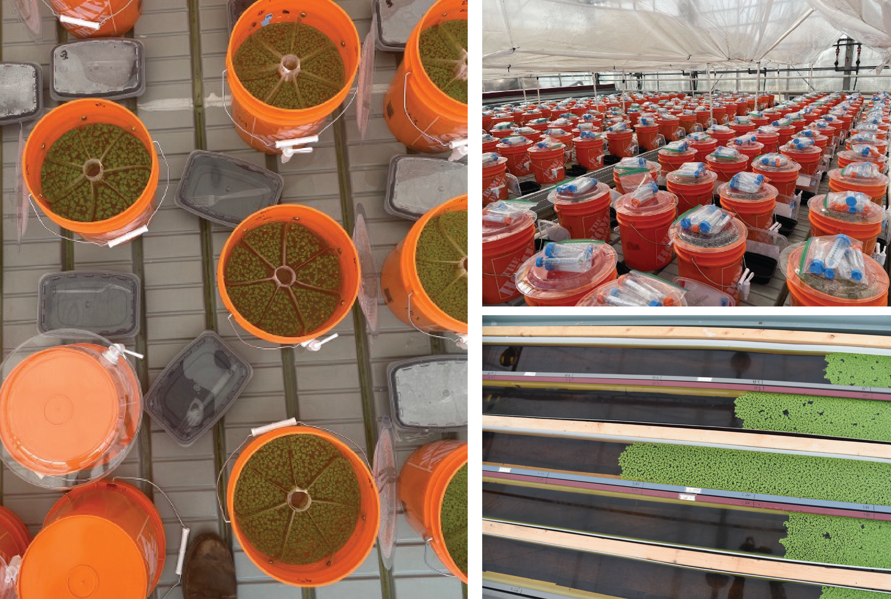
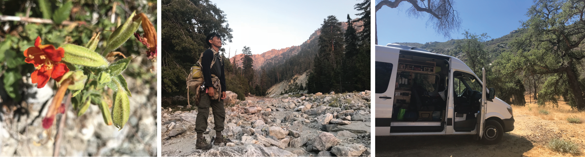

To answer foundational and contemporary questions at the intersection of ecology and evolution, my research uses model plant communities to conduct high-throughput and rigorous experiments in the lab, greenhouse, and using natural field communities.

### High-throughput lab experimental coevolution
In the lab, I use the (co-)evolution of competing duckweed species and their microbial symbionts to experimentally test theories on how population, community, and evolutionary dynamics unfold over space and time in real-time. The rapid generation time of duckweeds (2-7 days) are highly amenable to experimental evolution, and gnotobiotic techniques allow the experimental control and manipulation of host-associated microbial communities. My collaborators and I are currently integrating our robot-operated, imaging system with machine-learning approaches to tracking plant growth and phenotypes across space and over time.

### Large-scale mesocosm experiments
I also conduct large-scale, mesocosm experiments in the greenhouse to conduct common gardens and experimental evolution work involving plant communities at the scale of hundreds of thousands of individuals. I merge these mesocosm experiments with molecular work (population genetic, genomic, and epigenetic approaches) to provide extensive experiments that link molecular mechanisms and processes with ecological dynamics unfolding across multiple scales.

### Natural field experiments
Experiments conducted in the lab and greenhouse are most powerful when connected to ecological and evolutionary processes and patterns observed in natural plant communities in the field. I use a variety of approaches (e.g., transplants, exclusions, experimental evolution) in the field to connect the natural history and ecology of various plant systems to large-scale eco-evolutionary processes shaping species distributions and coexistence.

### Meta-analyses and scientific replicability
Meta-analyses in ecology and evolution can be a powerful tool for synthesizing overarching temporal (e.g., [Usui et al. 2017 J. Anim. Ecol.](https://besjournals.onlinelibrary.wiley.com/doi/full/10.1111/1365-2656.12612)) and spatial (e.g., [Bontrager et al. 2021 Evol.](https://onlinelibrary.wiley.com/doi/full/10.1111/evo.14231)) trends and elucidating their eco-evolutionary predictors. I have also used meta-analyses (and new meta-analytic methods) to explore scientific replicability: In an interdisciplinary collaboration spanning the fields of evolutionary biology (I-DEEL lab, University of New South Wales; Senior Lab, University of Sydney) and biomedical science (CAMARADES team, University of Edinburgh), we explored the idea that, counter to long-held belief, experimental standardization may actually lead to reduced replicability through generating idiosyncratic effects. We argue the importance of embracing variability in effect-sizes, and suggest that experimental methodologies that generate variability in effect sizes should be incorporated in a systematic manner ([Usui et al. 2020 PloS Biology](https://journals.plos.org/plosbiology/article?id=10.1371/journal.pbio.3001009)). <i>I am exploring this idea further in ecology and evolution, and would love to chat with any potential collaborators!</i>