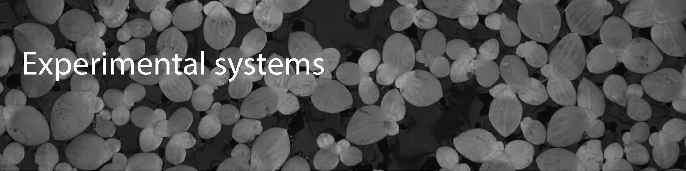
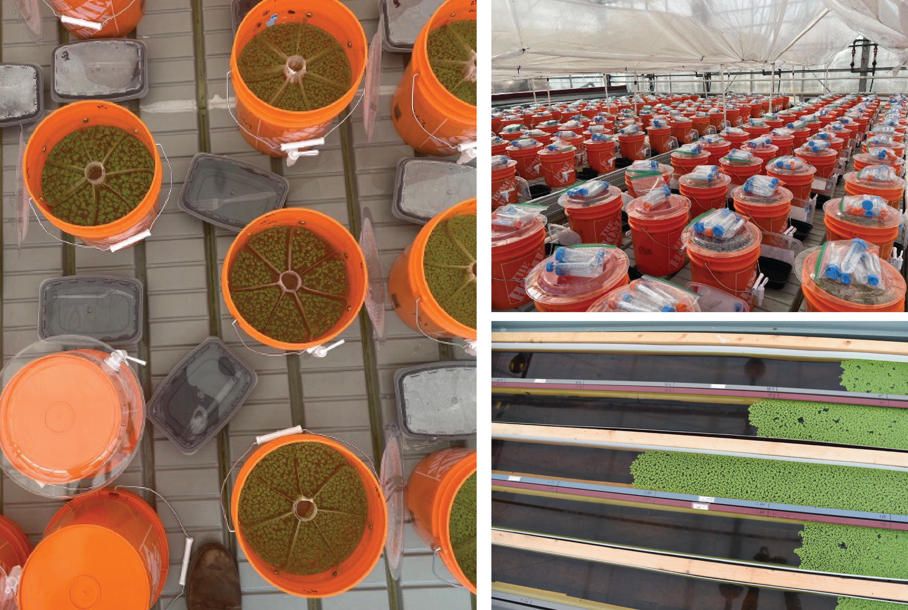
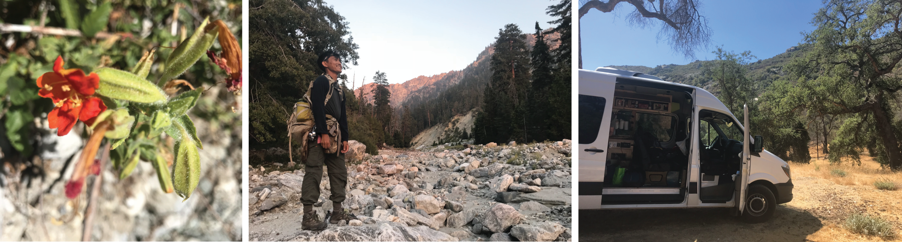

To answer foundational and contemporary questions at the intersection of ecology and evolution, much of my current research uses duckweed plants (and also their microbial symbionts) as model communities in high-throughput and rigorous experiments in the lab, greenhouse, and natural freshwater systems.

### High-throughput lab-experimental evolution
In the lab, I use experimental (co-)evolution of competing duckweed species, as well as co-evolution between duckweeds and their (mostly beneficial) microbial symbionts, to experimentally tease apart population, evolutionary, and community processes over space and in real-time. The rapid generation time of common duckweeds (2-7 days), the presence of naturally co-occurring and competing species, and the ease at which we can manipulate host-associated microbiomes, make this system highly suitable for experimental evolution work in communities. Together with [Megan Frederickson](http://mutualism.ca/) (University of Toronto), I am currently integrating robot-operated phenotyping systems with machine-learning approaches to track plants at the individual lineage-level across space and over time.

### Large-scale mesocosm experiments
In the greenhouse, mesocosm experiments using duckweed plants allow us to conduct large-scale common gardens using hundreds of globally sampled duckweed populations and species, as well as experimental evolution work at the scale of hundreds of thousands of individual plants. I merge these extensive mesocosm experiments with molecular work to allow us to link genetic mechanisms and processes with ecological dynamics unfolding across populations and communities.

### Natural field experiments
Experiments conducted in the lab and greenhouse are most powerful when connected to ecological and evolutionary processes and patterns observed in natural plant communities in the field. Here, I use a variety of approaches (e.g., common gardens and reciprocal transplants) in the field to connect the natural history and ecology of duckweeds to the eco-evolutionary dynamics of colonization, extinction, and species coexistence. Current projects include: (1) understanding how microbial communities alter the colonization dynamics of duckweed plants in natural ponds; (2) spatial variation in coexistence mechanisms; and (3) using population genomics approaches to understand the demographic history of globally-distributed, invasive, and cryptic duckweed species.

### Meta-analyses, data syntheses, and scientific replicability
Meta-analyses in ecology and evolution can be a powerful tool for synthesizing overarching temporal (e.g., [Usui et al. 2017 J. Anim. Ecol.](https://besjournals.onlinelibrary.wiley.com/doi/full/10.1111/1365-2656.12612)) and spatial (e.g., [Bontrager et al. 2021 Evol.](https://onlinelibrary.wiley.com/doi/full/10.1111/evo.14231)) trends and elucidating their eco-evolutionary predictors. I have also used meta-analyses (and new meta-analytic methods) to explore scientific replicability: In an interdisciplinary collaboration spanning the fields of evolutionary biology (I-DEEL lab, University of New South Wales; Senior Lab, University of Sydney) and biomedical science (CAMARADES team, University of Edinburgh), we explored the idea that (counter to long-held belief) experimental standardization may actually lead to reduced replicability through generating idiosyncratic effects. We argue the importance of embracing variability in effect-sizes, and suggest that experimental methodologies that generate variability in effect sizes should be incorporated in a systematic manner ([Usui et al. 2020 PloS Biology](https://journals.plos.org/plosbiology/article?id=10.1371/journal.pbio.3001009)). <i>I am exploring this idea further in ecology and evolution, and would love to chat with any potential collaborators!</i>